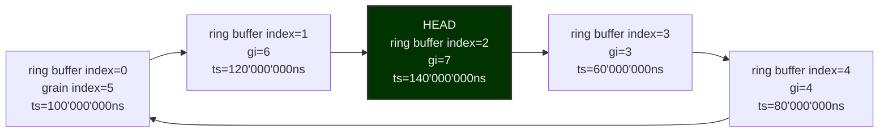

<!-- SPDX-FileCopyrightText: 2025 Contributors to the Media eXchange Layer project. -->
<!-- SPDX-License-Identifier: CC-BY-4.0 -->

# Timing: Ring buffers

Grains are organized as ring buffers. The grain count is a function of the flow grain_rate and desired history length. For example if a flow grain_rate is 50/1, each grain will be worth 20'000'000 ns (1/50 \* 1'000'000) of data. A ring buffer with 100ms of history will have 5 grains (5 \* 20ms/grain = 100ms). Time starts at the SMPTE 2059-1 epoch and is expressed a nanoseconds since that epoch.

## Example indexing

The following table demonstrates the indexing logic for a 50/1 fps video flow stored in a ring buffer of 5 grains.

| Grain Index | TAI Timestamp (ns since SMPTE ST 2059 epoch) | Ring buffer Index |
| ----------- | -------------------------------------------- | ----------------- |
| 0           | 0                                            | 0                 |
| 1           | 20'000'000                                   | 1                 |
| 2           | 40'000'000                                   | 2                 |
| 3           | 60'000'000                                   | 3                 |
| 4           | 80'000'000                                   | 4                 |
| 5           | 100'000'000                                  | 0                 |
| 6           | 120'000'000                                  | 1                 |
| 7           | 140'000'000                                  | 2                 |
| 8           | 160'000'000                                  | 3                 |
| 9           | 180'000'000                                  | 4                 |

The following graph demonstrates a ring buffer where the head has wrapped around and is now at ring buffer index 2 (the time span between grain 3 and 7 in the table above).

## Converting a timestamp (ns since SMPTE ST 2059 epoch) to a grain index

This conversion is a simple division:

$$
GrainDurationNs = GrainRateDenominator * 1'000'000'000 / GrainRateNumerator
$$

$$
GrainIndex = Timestamp / GrainDurationNs
$$

## Converting a grain index to a ring buffer index

The conversion is the remainder of the integer division of the grain index by the ring buffer length. :

$$
RingBufferIndex = GrainIndex \bmod RingBufferLength
$$

[Back to Timing overview](./Timing.md)
