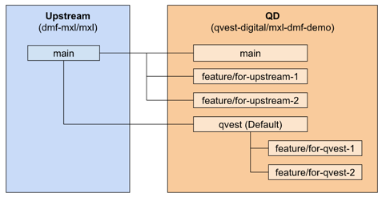

# Branch and Fork Management

This repository is a fork from the official DMF MXL repository and contains
some Qvest Digital specific proprietary changes. The way we manage both
upstream-targeted and Qvest specific changes is as follows.

- `main` in the QD fork is just a mirror of upstream `main`.
- features intended to be submitted to upstream are based on `main`.
- `qvest` is the branch containing all our proprietary patches and is based on
  upstream `main`.
    - All our proprietary features are based on the `qvest`-Branch. `qvest` is
      the default branch on our fork.
    - Sadly, GitHub does NOT offer us to change the default PR target, which
      means that we have to be
      careful! (https://github.com/orgs/community/discussions/11729). Alexander
      Erben add this diagram to repo!
